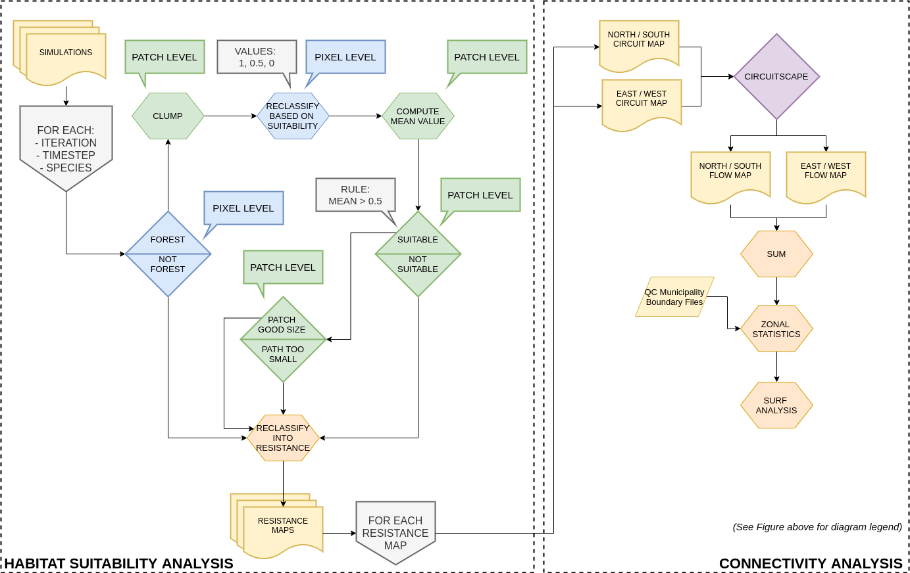

### M.Sc. Thesis 2018-2020

-----

[GitHub page
(latest)](https://vlucet.github.io/landchange-connectivity-monteregie/)

[Thesis PDF
(latest)](https://github.com/VLucet/landchange-connectivity-monteregie/blob/master/thesis/build/thesis.pdf)

[Initial submission
release](https://github.com/VLucet/landchange-connectivity-monteregie/)

-----

This repository contains all the code and some of the data that is
needed to reproduce the work of my MSc Thesis titled: **Integrating land
use and land cover change simulations and connectivity modeling: a case
study in the Montérégie region in southern Québec.** It is package under
the form of a [Docker
image](https://docs.docker.com/engine/reference/commandline/image/) and
makes use of the
[`renv`](https://rstudio.github.io/renv/articles/renv.html) package.

The goal of this repository is to allow future users to rerun the
analysis and build on it if necessary, but also to facilitate the
writing of the publication that will come out of the thesis by enforcing
good reproducibility practices early on in the publication process.

-----

#### How to reproduce this thesis

*Disclaimer 1: Although all the code for the thesis is archived here,
parts of the analysis are not reproducible, as some of the data used is
not in open access.*

*Disclaimer 2: The simulation code is designed to be paralellized on a
large linux machine (not an HPC environment) of the type [Arbutus
Compute Cloud](https://docs.computecanada.ca/wiki/Cloud_resources) from
Compute Canada. However, the final steps (analysis, figure making) can
be ran on computer of a much more modest size.*

##### 1\. Install Docker

You will need to install [Docker](https://docs.docker.com/get-docker/)
for running the analysis. The image will contain all dependencies
necessary.

##### 2\. Pull the Docker image

Open a terminal and pull the image. The tag `3.6.2-1` corresponds to the
version of R the image contains. The image is built on top of
`[rocker/geospatial:3.6.2](https://github.com/rocker-org/geospatial)`.
See further below for a detailed breakdown of the docker image.
*Warning:* the image is voluminous as it contains a custom (and large) R
library.

    docker push vlucet/land_con_monteregie:3.6.2-1

##### 3\. Run the Docker image

Once the image is downloaded, you can run it in a container. Multiple
options are possible. For simulation code, it is important to increase
the access to shared memory for the container with the option
`--shm-size` (give as much as you can afford, I usually use `50G`).

  - Run docker image (`docker run [options]
    vlucet/land_con_monteregie:3.6.2-1 /bin/bash && cd
    ~/land_con_monteregie`), executing a command that starts bash and
    move to the repo directory (`/bin/bash && cd
    ~/land_con_monteregie`), with options to run an interactive terminal
    (`-it`) with the rstudio user (needed, `-u rstudio`) with
    authentification disabled (`DISABLE_AUTH=true`).

<!-- end list -->

    docker run -it -u rstudio -e DISABLE_AUTH=true vlucet/land_con_monteregie:3.6.2-1 /bin/bash && cd ~/land_con_monteregie

  - Run docker image with rstudio in your browser (see [this
    post](https://ropenscilabs.github.io/r-docker-tutorial/02-Launching-Docker.html)
    for another example). Here you run the container in a detached mode
    (`-d`) on a local port (`-p 8787:8787`). Then, go to
    `http://192.168.99.100:8787` in your browser to access Rstudio.

<!-- end list -->

    docker run -d -p 8787:8787 -e DISABLE_AUTH=true vlucet/land_con_monteregie:3.6.2-1

#### Detailed workflow

The workflow of the thesis is made up mainly of `R` scripts, but also
makes use of a few `Julia`and `Python` scripts. The entire thesis
analysis and be easily re-run (providing that you have all the necessary
data) with the help of the main bash utility
[`landcon.sh`](https://github.com/VLucet/landchange-connectivity-monteregie/blob/master/landcon.sh)
in the top directory. This utility is used to run all the steps in the
thesis analysis. Help can be acessed with `landcon.sh -h`

    LAND USE CHANGE AND CON MODEL - 2020
    Valentin Lucet - Thesis McGill University
    
    Usage: [-p prep] [-m model no prep] [-a run all] [-f fit & predict]
           [-s stsim] [-r reclassify] [-c circuitscape] [-d post process] [-g make figures]

The first steps cover data preparation and Land Use change modeling (see
figure below):

  - `-p` Prepare the model data by transforming all raw data in
    processed model spatial (and some non-spatial) inputs.
  - `-m` Prepare model data by transforming processed spatial inputs
    into tabular input for use with the
    `[tidymodels](https://www.tidymodels.org/)` package.
  - `-f` Fit the land use change statistical model (Random Forest) and
    prepare STSIM spatial multipliers
  - `-s` Build STSIM library and run model, default to 10 timestep and
    10 iterations.

The rest of the steps cover habitat suitability analysis and
connectivity analysis (see second figure below):

  - `-r` Reclassify all STSIM outputs into Circuitscape inputs
    (resistance maps)
  - `-c` Run Circuitscape ([Julia
    package](https://github.com/Circuitscape/Circuitscape.jl))
  - `-d` Post process Circuitscape outputs into tabular data
  - `-g` Make figures, knitting the Rmd document that is the base of the
    github page for this repo (link at the top).

Finally you can also do: - `-a` Run ALL steps (again, provided data is
provided)

-----

#### Docker image detailed breakdwon

-----

#### renv lockfile breakdown

-----
