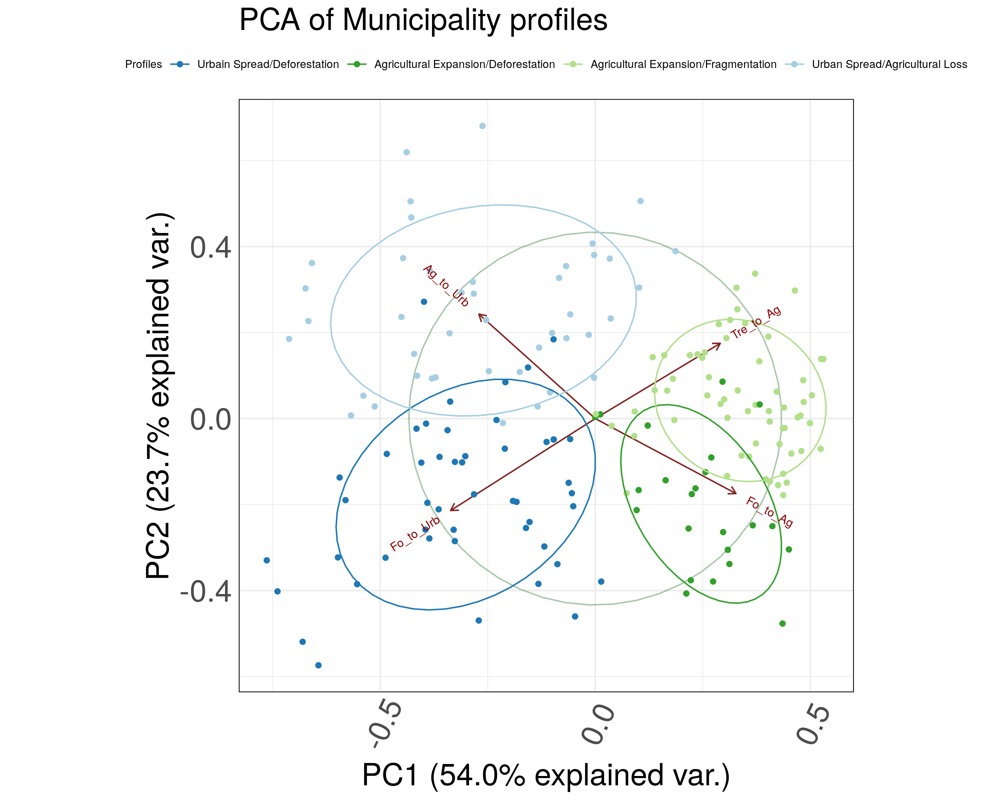
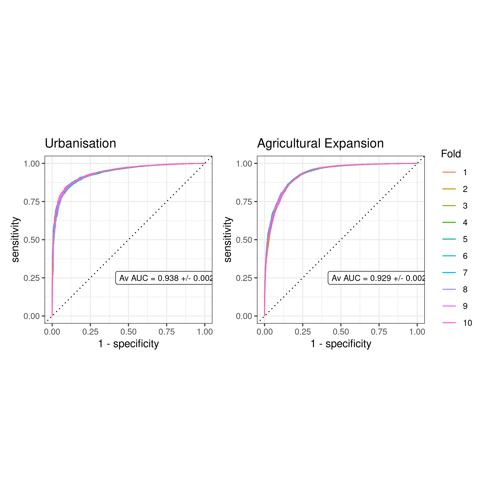
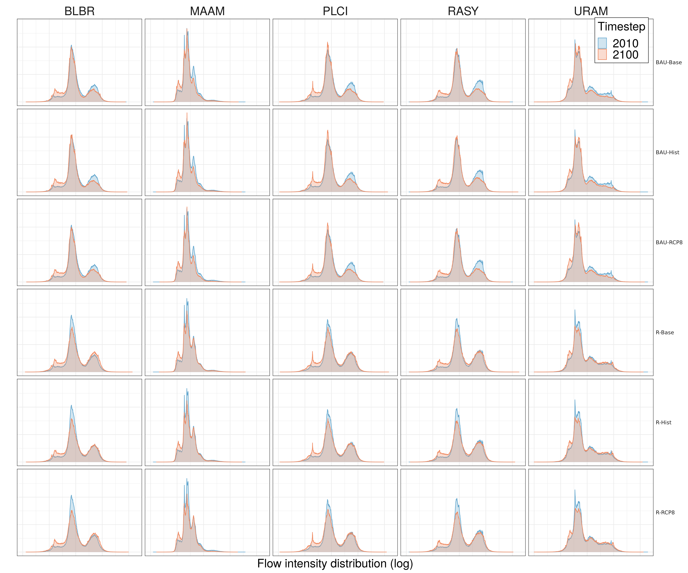
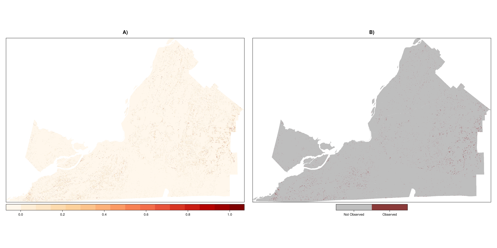

**This regroups most of the figures in the thesis (appendix figures are not included, except for the ROC resample figures, the BAU simulated land use change and the radar graph for change in flow for both chapters).**

```{r setup, include=FALSE}
knitr::opts_chunk$set(echo = TRUE)
suppressPackageStartupMessages({
  library(vegan)
  library(dendextend)
  library(ggbiplot)
  library(ggnewscale)
  library(raster)
  library(sf)
  library(tidyverse)
  library(ggplot2)
  library(gganimate)
  library(transformr)
  library(animation)
  library(rasterVis)
  library(ggmap)
  library(gifski)
  library(gtools)
  library(fmsb)
  library(RColorBrewer)
  library(scales)
  library(ggradar)
  library(tidymodels)
  library(patchwork)
  library(ggplotify)
})

theme_set(theme_minimal())
theme_update(legend.position = c(0.85, 0.20),
             legend.box = "vertical",
             legend.background = element_blank(),
             legend.box.background = element_rect(colour = "black"),
             panel.border = element_rect(fill = NA),
             legend.title = element_text(size = 22),
             legend.text = element_text(size = 22),
             plot.title = element_text(size=22),
             plot.subtitle = element_text(size=22),
             axis.text.x = element_text(angle=65, vjust=0.6, size =22),
             axis.text.y = element_text(size =22),
             strip.text.x = element_text(size = 22),
             strip.text.y = element_text(22),
             axis.title=element_text(size=22))
```

### Data prep

#### Cleaning and formatting

We start by preparing the data from the outputs of scripts `2.6`, `7.1` and `8.1`. The results table shown as output summarised all simulation efforts for the thesis. 

```{r data_prep, message=FALSE, warning=FALSE, paged.print=TRUE}
# Land use data 
trans_df <- read_csv("../outputs/final/land_use_trans_df.csv")
vals_df <- read_csv("../outputs/final/land_use_vals_df.csv")

# Results dir + mun and mrc shapefile
mun <- st_read("../data/mun/munic_SHP_clean.shp", quiet = TRUE)
mrc <- st_read("../data/raw/vector/mrc_SHP/mrc_polygone.shp",  quiet = TRUE)
mrc.mont <- mrc %>% filter(MRS_NM_REG=="Montérégie") 
mrc.mont.reproj <- st_transform(mrc.mont, raster::crs(mun))

# Classes
classes <- read_csv("../config/rcl_tables/land_use/recode_table.csv")
forest_classes <- read_csv("../config/rcl_tables/land_use/recode_table_forest.csv") %>% 
  rename(new_code = "ID", new_class = "Name")

classes_unique <- unique(classes[, c("new_code", "new_class")]) %>% 
  bind_rows(forest_classes)

# results key
sce_code_vec <- 
  as.vector(t(outer(c("BAU-", "R-", "CorPr-", "R-CorPr-", "R(T)-CorPr-"), 
                    c("Hist", "Base", "RCP8"), paste0)))
sce_code_vec_run <- 
  rep(c("BAU", "R", "CorPr", "R-CorPr", "R(T)-CorPr"), each=3)

results_clean <- read_csv("../outputs/final/stsim_run_results.csv") %>% 
  dplyr::select(scenarioId, name) %>% 
  mutate(name =  gsub(.$name, pattern = " \\(.+\\)", replacement = "")) %>% 
  mutate(sce =  paste0("sce_", .$scenarioId)) %>% 
  mutate(chapter = c("none", rep("both", 3), rep("chap_1", 3), rep("chap_2", 9))) %>% 
  mutate(splitted = str_split(name, " \\| ")) %>% 
  mutate(climate = unlist(map(splitted, ~unlist(.x[2])))) %>% 
  mutate(run = unlist(map(splitted, ~unlist(.x[1])))) %>% 
  dplyr::select(-splitted) %>% 
  replace_na(list(climate = "none")) %>% 
  mutate(code = c("Control", sce_code_vec)) %>% 
  mutate(code_run = c("control", sce_code_vec_run))

# Final extracted datasets
df_final <- read_csv("../outputs/final/final_df_current_density_part1.csv") %>%
  bind_rows(read_csv("../outputs/final/final_df_current_density_part2.csv")) %>% 
  mutate(timestep = (timestep*10)+1990, source = "model", zone = as.character(zone))
df_final_origin <- read_csv("../outputs/final/final_df_origin_current_density.csv") %>%
  mutate(timestep = timestep*10+1990, source = "model")

# Stratum key
stratum_key <- read_csv("../config/stsim/SecondaryStratum.csv") %>%
  mutate(ID = as.factor(ID)) %>%
  rename(zone=ID, MUS_NM_MUN=Name) %>%
  mutate(zone = as.character(zone)) %>% 
  left_join(df_final, by="zone") %>%
  filter(MUS_NM_MUN!="Not Monteregie")

# Sum all municipalities
df_summarised <- df_final %>%
  group_by(sce, timestep, species, iteration) %>% 
  summarise(sum_cur = sum(current)) %>% ungroup %>%
  mutate(source = "model")
df_origin_summarised <- df_final_origin %>%
  group_by(timestep, species) %>% 
  summarise(sum_cur = sum(mean)) %>% ungroup %>% 
  mutate(sce = "sce_0", source = "observation")

# Joined dataset
joined <- full_join(df_summarised, df_origin_summarised, 
                    by=c("sce", "source", "species", "timestep", "sum_cur")) %>% 
  left_join(results_clean, by = "sce")  %>% 
  replace_na(list(climate = "none", run = "historic run")) %>% 
  # Make factors
  mutate(sce = as.factor(sce), run = as.factor(run), sum_cur = 10*(sum_cur),
         climate = factor(climate, levels = c("none", "historic",
                                              "baseline", "RCP 8.5")),
         run = factor(run, levels = c("historic run", "BAU run", 
                                      "BAU run + corrs protection", "BAU run + ref", 
                                      "BAU run + corrs protection + ref",
                                      "BAU run + corrs protection + ref TARGETED")))

# Histogram data 
hist_original <- read_csv("../outputs/final/final_values_output_original.csv")
hist_true <- read_csv("../outputs/final/final_values_output_TRUE.csv") %>% 
  mutate(sce = "TRUE")
histograms <- read_csv("../outputs/final/final_values_output.csv") %>% 
  bind_rows(hist_original) %>% 
  bind_rows(hist_true) %>% 
  left_join(results_clean, by="sce") 

# SURF Data
surf <- read_csv("../surf/surf_output.csv") %>% 
  mutate(timestep = timestep*10+1990) %>% 
  left_join(results_clean, by=c("scenario"="scenarioId")) %>% 
  replace_na(list(climate = "none", run = "historic run")) %>% 
  # Make factors
  mutate(sce = as.factor(sce), run = as.factor(run),
         climate = factor(climate, levels = c("none", "historic",
                                              "baseline", "RCP 8.5")),
         run = factor(run, levels = c("historic run", "BAU run", 
                                      "BAU run + corrs protection", "BAU run + ref", 
                                      "BAU run + corrs protection + ref",
                                      "BAU run + corrs protection + ref TARGETED")))

# Bar plot data
bar_data <- read_csv("../outputs/final/final_bar_plot_data.csv")

results_clean
```

<!-- Preparing for spatial plotting (time consuming).

```{r data_prep_spatial, eval=FALSE, message=FALSE, warning=FALSE}
# Pivoted dataset for mapping
# df_final_fordiff_pivoted <- df_final %>% 
#   left_join(results_clean, by = "sce")  %>% 
#   group_by(zone, sce, species, timestep, source, chapter) %>% 
#   summarise(current = mean(current)) %>% ungroup %>% 
#   filter(timestep %in% c(2010, last(unique(stratum_key$timestep)))) %>% 
#   pivot_wider(names_from=timestep, values_from=current) %>% drop_na() %>% 
#   rename(before=last_col(offset = 1), after=last_col()) %>% 
#   left_join(stratum_key, by=c("zone", "sce", "species", "source")) %>% 
#   filter(MUS_NM_MUN!="Not Monteregie") %>% 
#   mutate(change=((after-before)/before)*100) %>% 
#   left_join(mun, by="MUS_NM_MUN") %>% 
#   st_as_sf()
# 
# df_final_fordiff_pivoted <- 
#   st_transform(df_final_fordiff_pivoted, crs=4326)
```

-->

### Figures

### Land use trends

We prepare the data for ordination and compute clustering (figures not displayed here).

```{r land_use_trends_prep, message=FALSE,  warning=FALSE, out.width="100%"}

# Trans

trans_mat_1990to2000 <- 
  trans_df %>% 
  dplyr::filter(Trans == "1990to2000", From!=To) %>% 
  mutate(trans_type = paste0(From,"to", To)) %>% 
  dplyr::select(-Trans, -From, -To) %>%
  spread(key=trans_type, value=Freq) %>% 
  rename(Mun=Municipality) %>% 
  arrange(Mun)
rownames(trans_mat_1990to2000) <- trans_mat_1990to2000$Mun
trans_only_mat <- Filter(function(x)!all(is.na(x)), trans_mat_1990to2000) %>% 
  mutate(Mun = paste0(str_sub(Mun,1,3), 1:length(Mun)))
trans_only_mat[is.na(trans_only_mat)] <- 0

trans_only_mat_noZero <- trans_only_mat[, c(TRUE, colSums(select(trans_only_mat, -Mun))>0)]
trans_only_mat_noZero <- 
  trans_only_mat_noZero[, c(1, order(colSums(select(trans_only_mat_noZero, -Mun)), decreasing=T)+1)]
rownames(trans_only_mat_noZero) <- trans_only_mat$Mun 

# Values

values_mat_1990to2000 <- 
  vals_df %>% 
  dplyr::filter(Year == 2010) %>%
  dplyr::select(-Year, -Unclassified) %>% 
  rename(Mun=Municipality) %>% 
  arrange(Mun) %>% 
  select(Mun, everything())
rownames(values_mat_1990to2000) <- values_mat_1990to2000$Mun
values_only_mat <- Filter(function(x)!all(is.na(x)), values_mat_1990to2000) %>% 
  mutate(Mun = paste0(str_sub(Mun,1,3), 1:length(Mun)))
values_only_mat[is.na(values_only_mat)] <- 0

values_only_mat_noZero <- values_only_mat[, c(TRUE, colSums(select(values_only_mat, -Mun))>0)]
values_only_mat_noZero <- 
  values_only_mat_noZero[, c(1, order(colSums(select(values_only_mat_noZero, -Mun)), decreasing=T)+1)]
rownames(values_only_mat_noZero) <- values_only_mat$Mun

```

Clustering for land use change transitions.

```{r land_use_trends_clust, message=FALSE,  warning=FALSE, out.width="100%"}
# Trans

trans_dist <- dist(decostand(trans_only_mat_noZero[,2:5], "hel"))
trans_clust <- hclust(trans_dist, method = "ward.D2")

trans_dendro <- as.dendrogram(trans_clust)
trans_memberships <- cutree(trans_clust,4)
# trans_memberships_names <- c("Urb-Def","AgEx-Def",
#                              "AgEx-DeTree","Urb-DeAg")[trans_memberships]
labels_colors(trans_dendro) <- trans_memberships[trans_clust$order]
#plot(trans_dendro)
```

Clustering for land use values.

```{r land_use_trends_clust_2, message=FALSE,  warning=FALSE, out.width="100%"}
# Vals

values_dist <- dist(decostand(values_only_mat_noZero[,2:5], "hel"))
values_clust <- hclust(values_dist, method = "ward.D2")

values_dendro <- as.dendrogram(values_clust)
values_memberships <- cutree(values_clust,5)
# values_memberships_names <- c("Forest - Dominant","Forest - Agriculture",
#                               "Agriculture - Dominant"," Urban - MD", 
#                               "Urban - HD")[values_memberships]
labels_colors(values_dendro) <- values_memberships[values_clust$order]
#plot(values_dendro)

# Figure out % of urban land in smallest group

# grp <- as.numeric(names(sort(table(values_memberships))[1]))
# urb <- values_only_mat_noZero[which(values_memberships == 4),]
```

Ordination of land use data (proportions) for municipalities

```{r land_use_trends_PCA, message=FALSE,  warning=FALSE, out.width="100%"}

# c('#1f78b4','#33a02c','#b2df8a','#a6cee3')

# PCA + map 

the_dpi = 300

# Trans

trans_minim.mat_noZero <- decostand(trans_only_mat_noZero[,2:5], "hel")
# "41to51"  "51to21"     "45to51"     "41to21"
names(trans_minim.mat_noZero) <- c("Fo_to_Ag", "Ag_to_Urb", "Tre_to_Ag", "Fo_to_Urb")

Trans_Pca <- prcomp(trans_minim.mat_noZero)

trans_biplot <- ggbiplot(Trans_Pca, scale = 1,
                         obs.scale = 1, var.scale = 1,
                         groups =  as.factor(trans_memberships),
                         ellipse = T, circle = TRUE) +
  scale_color_manual(name = "Profiles",
                     values = c('#1f78b4','#33a02c','#b2df8a','#a6cee3'), 
                     labels = c("Urbain Spread/Deforestation",
                                "Agricultural Expansion/Deforestation",
                                "Agricultural Expansion/Fragmentation", 
                                "Urban Spread/Agricultural Loss")) +
  theme(panel.background = element_rect(fill = "white", colour = "grey50"),
        legend.direction = 'horizontal', legend.position = 'top') +
  ggtitle("PCA of Municipality profiles")

ggsave(plot = trans_biplot, "../thesis/figures/PCA_trans_profiles.png", 
       height = 8, width = 10, dpi = the_dpi)

# trans_biplot
```



Geographical distribution of the 5 profiles identified.

```{r land_use_trends_map, message=FALSE,  warning=FALSE, out.width="100%"}

trans_member.table <- data.frame(MUS_NM_MUN = rownames(trans_mat_1990to2000)) %>% 
  mutate(code = paste0(str_sub(MUS_NM_MUN,1,3), 1:length(MUS_NM_MUN)), 
         membership = as.factor(trans_memberships))

# tbl.names <- table(mun.sub.18.clean$MUS_NM_MUN)
# more.than.one <- tbl.names[tbl.names>1]

mun %>% 
  select(MUS_NM_MUN) %>% 
  group_by(MUS_NM_MUN) %>%
  dplyr::summarise(MUS_NM_MUN_New = first(MUS_NM_MUN)) ->
  mun.sub.18.clean.merged

trans_mun.sub.18.clean.mod <- 
  left_join(mun.sub.18.clean.merged, trans_member.table, by="MUS_NM_MUN")

map_trans <- ggplot() + geom_sf(data = trans_mun.sub.18.clean.mod, 
                                aes(fill = as.factor(membership))) +
  scale_fill_manual(name = "Profiles",
                    values = c('#1f78b4','#33a02c','#b2df8a','#a6cee3'), 
                    labels = c("Urbain Spread/Deforestation",
                               "Agricultural Expansion/Deforestation",
                               "Agricultural Expansion/Fragmentation", 
                               "Urban Spread/Agricultural Loss")) +
  geom_sf(data = mrc.mont.reproj, fill=NA, color=alpha("black",1)) +
  theme_bw() +
  theme(legend.justification=c(0,1), legend.position=c(0.02,0.98))

ggsave(plot = map_trans, "../thesis/figures/transition_prof_map.png", 
       height = 8, width = 12, dpi = the_dpi)

#map_trans
```


Ordination of land use transition data for municipalities.

```{r land_use_trends_PCA_2, message=FALSE,  warning=FALSE, out.width="100%"}

# Vals

# c("#B2DF8A", "#33A02C", "#FF7F00", "#CAB2D6", "#6A3D9A")

values_minim.mat_noZero <- decostand(values_only_mat_noZero[,c(2:5)], "hel")

Values_Pca <- prcomp(values_minim.mat_noZero)

vals_biplot <- ggbiplot(Values_Pca, scale = 1,
                        obs.scale = 1, var.scale = 1,
                        groups = as.factor(values_memberships),
                        ellipse = T, circle = TRUE) +
  scale_color_manual(name = "Profiles",
                     values = c("#33A02C", "#B2DF8A", "#FF7F00", "#CAB2D6", "#6A3D9A"), 
                     labels = c("Forest - Agriculture",
                                "Forest - Dominant",
                                "Agriculture - Dominant",
                                "Urban - Medium Density", 
                                "Urban - High Density"))+
  theme(panel.background = element_rect(fill = "white", colour = "grey50"),
        legend.direction = 'horizontal', legend.position = 'top') +
  ggtitle("PCA of Municipality profiles")

ggsave(plot = vals_biplot, "../thesis/figures/PCA_data_profiles.png", 
       height = 8, width = 10, dpi = the_dpi)

#vals_biplot
```


Geographical distribution of the 4 change profiles identified

```{r land_use_trends_map_2, message=FALSE,  warning=FALSE, out.width="100%"}

values_member.table <- data.frame(MUS_NM_MUN = rownames(values_mat_1990to2000)) %>% 
  mutate(code = paste0(str_sub(MUS_NM_MUN,1,3), 1:length(MUS_NM_MUN)), 
         membership = as.factor(values_memberships))

values_mun.sub.18.clean.mod <- 
  left_join(mun.sub.18.clean.merged, values_member.table, by="MUS_NM_MUN")

map_vals <- ggplot() + geom_sf(data = values_mun.sub.18.clean.mod, 
                               aes(fill = as.factor(membership))) +
  scale_fill_manual(name = "Profiles",
                    values = c("#33A02C", "#B2DF8A", "#FF7F00", "#CAB2D6", "#6A3D9A"), 
                    labels = c("Forest - Agriculture",
                               "Forest - Dominant",
                               "Agriculture - Dominant",
                               "Urban - Medium Density", 
                               "Urban - High Density")) +
  geom_sf(data = mrc.mont.reproj, fill=NA, color=alpha("black",1)) +
  theme_bw() +
  theme(legend.justification=c(0,1), legend.position=c(0.02,0.98))

ggsave(plot = map_vals, "../thesis/figures/profiles_land_use.png", 
       height = 8, width = 12, dpi = the_dpi)

#map_vals
```


### Mean current flow change

#### Historic

Change in mean flow (in \% of the the 1990 flow) between 1990 and 2010, contrasting observed historic change (1990-2010) and simulated change from historic model run.

```{r fig_1_historic, message=FALSE, out.width="100%", fig.cap="Connectivity change for species through time, 1990-2010"}

the_width = 18 
the_height = 15
the_dpi = 500

fig_1_historic <- joined %>% 
  filter(climate == "none") %>% 
  group_by(scenarioId, species, iteration) %>% 
  group_modify(~mutate(.x , baseline = subset(.x, timestep == 1990)$sum_cur, 
                       the_diff = ((sum_cur-baseline)/baseline)*100 )) %>% 
  ggplot(aes(x=timestep, y=the_diff, col=source)) +
  scale_color_manual(values=c('#d8b365','#5ab4ac'), 
                     labels = c("Model", "Observation")) +
  geom_smooth(aes(group = sce), method = "glm", se=FALSE) +
  scale_linetype_manual(values = c(1,3,2,5))+
  geom_point(aes(group = sce)) +
  facet_wrap(~species, scales = "fixed") +
  labs(y = "Current flow (% Change)",
       x = "Year",
       col = "Source") +
  NULL
#fig_1_historic
ggsave(fig_1_historic,
       filename = "../thesis/figures/connectivity_decrease_x5species_historic.png",
       width = the_width, height = the_height, dpi = the_dpi)
```


#### Chap 1

##### Line graph

Change in mean flow (in \% of the the 2010 flow) between 2010 (observed) and 2100 (predicted), contrasting BAU scenario (solid line) with other land use change scenarios - linear graph.

```{r figure_1_model_1, message=FALSE,  warning=FALSE, out.width="100%", fig.cap="Connectivity change for species through time, 2010-2100"}
colors_sce <- 
  data.frame(sce = c("Hist", "Baseline", "RCP85"), 
             color = c("#8DA0CB", "#FC4E2A", "#800026"), stringsAsFactors = F)

fig_1_static_chap_1 <- joined %>% 
  filter(climate != "none", chapter %in% c("none", "both", "chap_1")) %>% 
  group_by(scenarioId, species, iteration) %>% 
  group_modify(~mutate(.x , baseline = subset(.x, timestep == 2010)$sum_cur, 
                       the_diff = ((sum_cur-baseline)/baseline)*100 )) %>% 
  ggplot(aes(x=timestep, y=the_diff, col=climate)) +
  scale_color_manual(values = colors_sce$color, 
                     labels = c("Historic", "Baseline", "RCP 8.5")) +
  geom_smooth(aes(group = sce, linetype=code_run), alpha=0.5, method="loess") +
  #geom_point(aes(group = sce)) +
  scale_linetype_manual(values=c("solid", "twodash")) +
  facet_wrap(~species, scales = "fixed") +
  geom_hline(yintercept = 0, linetype = "dashed", alpha = 0.5) +
  #geom_vline(xintercept = 2020, linetype = "dashed", color = "darkGreen", alpha = 0.5) +
  labs(y = "Current flow (% Change)",
       x = "Year",
       col = "Climate",
       linetype = "Run") +
  guides(col = guide_legend(ncol = 2, nrow=2), 
         linetype = guide_legend(nrow=1, override.aes = list(colour = 'black'))) +
  theme(legend.position = c(0.85, 0.15))+
  NULL
#fig_1_static_chap_1
ggsave(fig_1_static_chap_1, 
       filename = "../thesis/figures/connectivity_decrease_x5species_chap1.png", 
       width = the_width, height = the_height, dpi = the_dpi)
```


##### Radar Graph

Change in mean flow (in \% of the the 2010 flow) between 2010 (observed) and 2100 (predicted), contrasting BAU scenario with other land use change scenarios - radar graph.

```{r figure_1_model_1_radar, message=FALSE, warning=FALSE, out.width="100%"}

# Default size
gridline.label.offset	= 4
legend.text.size = 20
group.line.width = 0.9
grid.label.size = 10
background.circle.colour	= "#ffffff"
group.point.size	= 5
axis.label.size = 8
group.colours = RColorBrewer::brewer.pal(name = "Paired",n=10)[c(2,4,6,8,10)]


radar_data_chap1 <- joined %>% 
  filter(climate != "none", chapter %in% c("none", "both", "chap_1")) %>% 
  group_by(timestep, species, code) %>% 
  summarise(sum_cur = mean(sum_cur)) %>% ungroup %>% 
  pivot_wider(names_from = timestep, values_from = sum_cur) %>% 
  mutate(diff = ((`2100`-`2010`)/`2010`)*100) %>% 
  select(-c(`2010`:`2100`)) %>%  
  pivot_wider(names_from = code, values_from = diff) %>% 
  rename(group = species)

radar_chap1 <-  
  ggradar(radar_data_chap1, centre.y = -20, legend.position = "right",
          grid.min = -20, grid.max = 3, grid.mid = 0, 
          values.radar = c("-20 %", "0 %", ""), 
          group.colours = group.colours,
          gridline.label.offset	= gridline.label.offset, 
          legend.text.size = legend.text.size,
          group.line.width = group.line.width, 
          grid.label.size = grid.label.size,
          background.circle.colour = background.circle.colour, 
          group.point.size	= group.point.size, 
          axis.label.size = axis.label.size)
#radar_chap1
ggsave("../thesis/figures/radar_ggradar_chap1.png", radar_chap1,
       width = the_width, height = the_height, dpi = the_dpi)
```


#### Chap 2

Change in mean flow (in \% of the the 2010 flow) between 2010 (observed) and 2100 (predicted), contrasting BAU scenario (solid line) with other conservation scenarios - linear graph.

```{r figure_1_model_2, message=FALSE, warning=FALSE, out.width="100%", fig.cap="Connectivity change for species through time, 2010-2100"}
fig_1_static_chap_2 <- joined %>% 
  filter(climate != "none", chapter %in% c("none", "both", "chap_2")) %>% 
  group_by(scenarioId, species, iteration) %>% 
  group_modify(~mutate(.x , baseline = subset(.x, timestep == 2010)$sum_cur, 
                       the_diff = ((sum_cur-baseline)/baseline)*100 )) %>% 
  ggplot(aes(x=timestep, y=the_diff, col=climate)) +
  scale_color_manual(values = colors_sce$color,
                     labels = c("Historic", "Baseline", "RCP 8.5")) +
  geom_smooth(aes(group = sce, linetype=code_run), alpha=0.5, method="loess") +
  scale_linetype_manual(values=c("solid", "dashed", "longdash", "dotted")) +
  facet_wrap(~species, scales = "fixed") +
  geom_hline(yintercept = 0, linetype = "dashed", alpha = 0.5) +
  geom_vline(xintercept = 2020, linetype = "dashed", color = "darkGreen", alpha = 0.5) +
  labs(y = "Current flow (% Change)",
       x = "Year",
       col = "Climate",
       linetype = "Run") +
  guides(col = guide_legend(ncol = 2, nrow=2), 
         linetype = guide_legend(nrow = 2, ncol=2, 
                                 override.aes = list(colour = 'black'))) +
  theme(legend.position = c(0.85, 0.15))+
  NULL
#fig_1_static_chap_2
ggsave(fig_1_static_chap_2, 
       filename = "../thesis/figures/connectivity_decrease_x5species_chap2.png", 
       width = the_width, height = the_height, dpi = the_dpi)
```


##### Radar Graph

Change in mean flow (in \% of the the 2010 flow) between 2010 (observed) and 2100 (predicted), contrasting BAU scenario (solid line) with other conservation scenarios - radar graph.

```{r figure_1_model_2_radar, message=FALSE, warning=FALSE, out.width="100%"}
radar_data_chap2 <- joined %>% 
  filter(climate != "none", chapter %in% c("none", "both","chap_2")) %>% 
  group_by(timestep, species, code) %>% 
  summarise(sum_cur = mean(sum_cur)) %>% ungroup %>% 
  pivot_wider(names_from = timestep, values_from = sum_cur) %>% 
  mutate(diff = ((`2100`-`2010`)/`2010`)*100) %>% 
  select(-c(`2010`:`2100`)) %>%  
  pivot_wider(names_from = code, values_from = diff) %>% 
  rename(group = species)

radar_chap2 <-  
  ggradar(radar_data_chap2, centre.y = -20, legend.position = "right",
          grid.min = -20, grid.max = 3, grid.mid = 0, 
          values.radar = c("-20 %", "0 %", ""), 
          group.colours = group.colours,
          gridline.label.offset	= gridline.label.offset, 
          legend.text.size = legend.text.size,
          group.line.width = group.line.width, 
          grid.label.size = grid.label.size,
          background.circle.colour = background.circle.colour, 
          group.point.size	= group.point.size, 
          axis.label.size = axis.label.size-2)
#radar_chap2
ggsave("../thesis/figures/radar_ggradar_chap2.png", radar_chap2,
       width = the_width, height = the_height, dpi = the_dpi)
```


#### Both 

##### Radar Graph

Change in mean flow (in \% of the the 2010 flow) between 2010 (observed) and 2100 (predicted), contrasting BAU scenario (solid line) with all other scenarios from borth chapters - radar graph.

```{r figure_1_model_both_radar, message=FALSE, warning=FALSE, out.width="100%"}
radar_data_all <- joined %>% 
  filter(climate != "none") %>% 
  group_by(timestep, species, code) %>% 
  summarise(sum_cur = mean(sum_cur)) %>% ungroup %>% 
  pivot_wider(names_from = timestep, values_from = sum_cur) %>% 
  mutate(diff = ((`2100`-`2010`)/`2010`)*100) %>% 
  select(-c(`2010`:`2100`)) %>%  
  pivot_wider(names_from = code, values_from = diff) %>% 
  rename(group = species)

radar_all <-  
  ggradar(radar_data_all, centre.y = -20, legend.position = "right",
          grid.min = -20, grid.max = 3, grid.mid = 0, 
          values.radar = c("-20 %", "0 %", ""), 
          group.colours = group.colours,
          gridline.label.offset	= gridline.label.offset, 
          legend.text.size = legend.text.size,
          group.line.width = group.line.width, 
          grid.label.size = grid.label.size,
          background.circle.colour = background.circle.colour, 
          group.point.size	= group.point.size, 
          axis.label.size = axis.label.size-2)
#radar_all
ggsave("../thesis/figures/radar_ggradar_both.png", radar_all,
       width = the_width, height = the_height, dpi = the_dpi)
```


### ROC Curves

ROC curves from fitting both models (with resampling), plotted with the `patchwork` package.

```{r roc_curves, eval=!(params$REPRO_FIGS_ONLY), message=FALSE, warning=FALSE, out.width="100%"}
# Roc curves data
urb <- readRDS("../data/temp/fit_rs_outcome_rf_urb_2.RDS")
agex <- readRDS("../data/temp/fit_rs_outcome_rf_agex_2.RDS")

p1 <- bind_rows(urb, .id = "fold") %>% 
  mutate(Fold = factor(fold, levels = as.character(1:10))) %>% 
  group_by(Fold) %>% 
  roc_curve(.pred, truth = outcome_fact) %>% 
  autoplot(add=T) +
  ggtitle(paste("Urbanisation")) +
  annotate(x = 0.75, y = 0.25, geom="label", size = 3,
           label = as.character(paste("Av AUC = 0.938 +/- 0.002"))) +
  theme(legend.position = "none") +
  NULL

p2 <- bind_rows(agex, .id = "fold") %>% 
  mutate(Fold = factor(fold, levels = as.character(1:10))) %>% 
  group_by(Fold) %>% 
  roc_curve(.pred, truth = outcome_fact) %>% 
  autoplot(add=T) +
  ggtitle(paste("Agricultural Expansion")) +
  annotate(x = 0.75, y = 0.25, geom="label", size = 3,
           label = as.character(paste("Av AUC = 0.929 +/- 0.002"))) +
  NULL

full = p1 + p2

#full
ggsave("../thesis/figures/double_roc_resample.png", full)
```



### Histograms

#### Historic

Histograms of flow values for the year 2010 comparing the historic model run (1990-2010) with observations.

```{r original_hists, message=FALSE, warning=FALSE, out.width="100%"}

bi_colors <- c("#67a9cf", "#ef8a62")

hist_plot_origin <- histograms %>%
  filter(sce %in% c("TRUE", "sce_37")) %>% 
  filter(ts == 2) %>% 
  mutate(ts = ts*10+1990) %>% 
  mutate(ts = as.factor(ts)) %>% 
  ggplot(aes(x=bins, y=n, fill=sce, colour =sce)) + 
  geom_density(stat='identity', show.legend=T, alpha=0.3)+
  scale_fill_manual(values = bi_colors, name="Source", labels=c("Model", "Observation")) +
  scale_color_manual(values = bi_colors, name="Source", labels=c("Model", "Observation")) +
  facet_wrap(~species) +
  labs(x = "Flow intensity distribution (log)", 
       y = "") +
  theme(strip.text.y = element_text(angle=360, size=10, hjust = 0), 
        axis.text.x=element_blank(),
        axis.ticks.x=element_blank(), 
        axis.text.y.left = element_blank(),
        axis.ticks.y.left = element_blank()) +
  NULL
#hist_plot_origin
ggsave("../thesis/figures/original_hists.png", hist_plot_origin,
       width = the_width, height = the_height, dpi = the_dpi)
```


#### Chap 1

Histograms of flow values for all species and scenarios, for 2010 (observed) and 2100 (predicted).

```{r hist_plot_1, message=FALSE, warning=FALSE, out.width="100%"}

bi_colors <- c("#67a9cf", "#ef8a62")

hist_plot_1 <- histograms %>% 
  mutate(ts = as.factor(ts)) %>% 
  filter(chapter %in% c('both', 'chap_1')) %>%  
  ggplot(aes(x=bins, y=n, group=ts)) + 
  geom_density(stat='identity', show.legend=T, aes(fill=factor(ts), color=factor(ts)), alpha=0.3)+
  facet_grid(code~species) +
  scale_fill_manual(values = bi_colors, 
                    labels = c("2010", "2100")) +
  scale_color_manual(values = bi_colors, 
                     labels = c("2010", "2100")) +
  labs(x = "Flow intensity distribution (log)", 
       y = "")+
  theme(strip.text.y = element_text(angle=360, size=10, hjust = 0), 
        axis.text.x=element_blank(),
        axis.ticks.x=element_blank(), 
        axis.text.y.left = element_blank(),
        axis.ticks.y.left = element_blank(), 
        legend.position = c(0.95, 0.96)) +
  labs(color="Timestep", fill="Timestep") +
  NULL
#hist_plot_1
ggsave("../thesis/figures/hist_chap1.png", hist_plot_1, width = 18, height = 15)
```



#### Chap 2

Histograms of flow values for all species and scenarios, for 2010 (observed) and 2100 (predicted).

```{r hist_plot_2, message=FALSE, warning=FALSE, out.width="100%"}
hist_plot_2 <- histograms %>% 
  mutate(ts = as.factor(ts)) %>% 
  filter(chapter %in% c('chap_2')) %>%  
  ggplot(aes(x=bins, y=n, group=ts)) + 
  geom_density(stat='identity', aes(fill=factor(ts),  colour=factor(ts)), alpha=0.3)+
  facet_grid(code~species) +
  scale_fill_manual(values = bi_colors, 
                    labels = c("2010", "2100")) +
  scale_color_manual(values = bi_colors, 
                     labels = c("2010", "2100")) +
  labs(x = "Flow intensity distribution (log)", 
       y = "") +
  theme(strip.text.y = element_text(angle=360, size=10, hjust = 0), 
        axis.text.x=element_blank(),
        axis.ticks.x=element_blank(), 
        axis.text.y.left = element_blank(),
        axis.ticks.y.left = element_blank(),
        legend.position = c(0.95, 0.96)) +
  labs(color="Timestep", fill="Timestep") +
  NULL
#hist_plot_2
ggsave("../thesis/figures/hist_chap2.png", hist_plot_2, width = 18, height = 20)
```


### SURF Analysis

#### Chap1

##### Linear Graph

Change in the number of features (in \% of the the 2010 flow) identified by the SURF analyssis between 2010 (observed) and 2100 (predicted), contrasting BAU scenario with other land use change scenarios - linear graph.

```{r surf_1, message=FALSE, warning=FALSE, out.width="100%"}
surf_1 <- surf %>% 
  mutate(scenario = as.factor(scenario)) %>% 
  filter(climate != "none", chapter %in% c("none", "both", "chap_1")) %>% 
  filter(climate != "none") %>% 
  group_by(scenario, species, iter) %>% 
  group_modify(~mutate(.x , baseline = subset(.x, timestep == 2010)$kp_nb, 
                       the_diff = ((kp_nb-baseline)/baseline)*100 )) %>% ungroup %>% 
  ggplot(aes(x = timestep, y = the_diff, color=climate)) +
  scale_linetype_manual(values=c("solid", "twodash")) +
  geom_smooth(aes(group = scenario, linetype=code_run), alpha=0.2, method="loess")+
  #geom_point(aes(group=scenario), alpha= 0.05, size = 0.5)+
  facet_wrap(~species, scales = "fixed")+
  scale_color_manual(values = colors_sce$color,
                     labels = c("Historic", "Baseline", "RCP 8.5")) +
  labs(y = "Change in nb of Keypoints detected (%)",
       x = "Year",
       col = "Climate",
       linetype = "Run") +
  guides(col = guide_legend(ncol = 2, nrow=2), 
         linetype = guide_legend(nrow=1, override.aes = list(colour = 'black'))) +
  NULL
#surf_1
ggsave("../thesis/figures/surf_chap1.png", surf_1,
       width = the_width, height = the_height, dpi = the_dpi)
```


##### Radar Graph

Change in the number of features (in \% of the the 2010 flow) identified by the SURF analyssis between 2010 (observed) and 2100 (predicted), contrasting BAU scenario with other land use change scenarios - radar graph.

```{r surf_radar_1, message=FALSE, warning=FALSE, out.width="100%"}
surf_radar_data_1 <- surf %>% 
  filter(climate != "none", chapter %in% c("none", "both","chap_1")) %>% 
  filter(sce != "sce_0", name != "historic run") %>% 
  group_by(timestep, species, code) %>% 
  summarise(kp_nb = mean(kp_nb)) %>% ungroup %>% 
  pivot_wider(names_from = timestep, values_from = kp_nb) %>% 
  mutate(diff = ((`2100`-`2010`)/`2010`)*100) %>% 
  select(-c(`2010`:`2100`)) %>%  
  pivot_wider(names_from = code, values_from = diff) %>% 
  rename(group = species)

surf_radar_1 <- 
  ggradar(surf_radar_data_1, centre.y = -60, legend.position = "right",
          grid.min = -60, grid.max = 5, grid.mid = 0, 
          values.radar = c("-60 %", "0 %", ""), 
          group.colours = group.colours,
          gridline.label.offset	= 20, 
          legend.text.size = legend.text.size,
          group.line.width = group.line.width, 
          grid.label.size = grid.label.size,
          background.circle.colour = background.circle.colour, 
          group.point.size	= group.point.size, 
          axis.label.size = axis.label.size)
# surf_radar_1
ggsave("../thesis/figures/surf_radar_chap1.png", surf_radar_1,
       width = the_width, height = the_height, dpi = the_dpi)
```


#### Chap 2

##### Linear Graph

Change in the number of features (in \% of the the 2010 flow) identified by the SURF analyssis between 2010 (observed) and 2100 (predicted), contrasting BAU scenario with other conservation scenarios - linear graph.

```{r surf_2, message=FALSE, warning=FALSE, out.width="100%"}
surf_2 <- surf %>% 
  mutate(scenario = as.factor(scenario)) %>% 
  filter(climate != "none", chapter %in% c("none", "both", "chap_2")) %>% 
  filter(climate != "none") %>% 
  group_by(scenario, species, iter) %>% 
  group_modify(~mutate(.x , baseline = subset(.x, timestep == 2010)$kp_nb, 
                       the_diff = ((kp_nb-baseline)/baseline)*100 )) %>% ungroup %>% 
  ggplot(aes(x = timestep, y = the_diff, color=climate)) +
  geom_smooth(aes(group = scenario, linetype=code_run), alpha=0.2, method="loess")+
  #geom_point(aes(group=scenario), alpha= 0.05, size = 0.5)+
  scale_linetype_manual(values=c("solid", "dashed", "longdash", "dotted")) +
  facet_wrap(~species, scales = "fixed")+
  scale_color_manual(values = colors_sce$color,
                     labels = c("Historic", "Baseline", "RCP 8.5")) +
  labs(y = "Change in nb of Keypoints detected (%)",
       x = "Year",
       col = "Climate",
       linetype = "Run") +
  guides(col = guide_legend(ncol = 2, nrow=2), 
         linetype = guide_legend(nrow=2, ncol=2, 
                                 override.aes = list(colour = 'black'))) +
  NULL
#surf_2
ggsave("../thesis/figures/surf_chap2.png", surf_2,
       width = the_width, height = the_height, dpi = the_dpi)
```


##### Radar Graph

Change in the number of features (in \% of the the 2010 flow) identified by the SURF analyssis between 2010 (observed) and 2100 (predicted), contrasting BAU scenario with other conservation scenarios - radar graph.

```{r surf_radar_2, message=FALSE, warning=FALSE, out.width="100%"}
surf_radar_data_2 <- surf %>% 
  filter(climate != "none", chapter %in% c("none", "both","chap_2")) %>% 
  filter(sce != "sce_0", name != "historic run") %>% 
  group_by(timestep, species, code) %>% 
  summarise(kp_nb = mean(kp_nb)) %>% ungroup %>% 
  pivot_wider(names_from = timestep, values_from = kp_nb) %>% 
  mutate(diff = ((`2100`-`2010`)/`2010`)*100) %>% 
  select(-c(`2010`:`2100`)) %>%  
  pivot_wider(names_from = code, values_from = diff) %>% 
  rename(group = species)

surf_radar_2 <- 
  ggradar(surf_radar_data_2, centre.y = -60, legend.position = "right",
          grid.min = -60, grid.max = 5, grid.mid = 0, 
          values.radar = c("-60 %", "0 %", ""), 
          group.colours = group.colours,
          gridline.label.offset	= 22, 
          legend.text.size = legend.text.size,
          group.line.width = group.line.width, 
          grid.label.size = grid.label.size,
          background.circle.colour = background.circle.colour, 
          group.point.size	= group.point.size, 
          axis.label.size = axis.label.size-2)
#surf_radar_2
ggsave("../thesis/figures/surf_radar_chap2.png", surf_radar_2, 
       width = the_width, height = the_height, dpi = the_dpi)
```


### Prediction maps

```{r 2010_compare_prep, eval=!(params$REPRO_FIGS_ONLY), message=FALSE, warning=FALSE, out.width="100%"}
list_of_files <-  list.files("../libraries/stsim/monteregie-conncons-scripted.ssim.output/Scenario-37/stsim_OutputSpatialState", full.names = T)
list_of_files <- list_of_files[grep(x=list_of_files, "ts2")]
stratum <- raster("../data/stsim/aggregated/primary_stratum_mont_or_not_or_PA.tif")
```

Predicted probability of urbanization (left) vs observed urbanization (right) between 1990 and 2010.

```{r 2010_compare_urb, eval=!(params$REPRO_FIGS_ONLY), message=FALSE, warning=FALSE, out.width="100%"}
names <- paste0(c("historic_compare_agex", "historic_compare_urb"), ".png")

for (class in c(1:2)){
  
  the_stack <- stack(lapply(list_of_files, raster)) == class
  original <- raster("../data/land_use/aggregated/aggregated_lu_buffered_1990_patched.tif") == class
  final <- raster("../data/land_use/aggregated/aggregated_lu_buffered_2010_patched.tif") == class
  
  # Transform, give names
  the_stack[original == 1] <- 0
  final[original == 1] <- 0
  the_stack[stratum==0] <- NA
  final[stratum==0] <- NA
  the_stack <- trim(the_stack)
  final <- trim(final)
  
  the_mean <-  mean(the_stack)
  names(the_mean) <- "mean"
  names(final) <- "observation"
  
  # test <- the_mean
  # test[(which(values(!is.na(final)) & values(is.na(the_mean))))] <- 100
  # plot(test)
  
  # Fill the "other" values
  the_mean[(which(values(!is.na(final)) & values(is.na(the_mean))))] <- 0
  
  stack_to_plot <- stack(the_mean, final) 
  names(stack_to_plot) <- c("Model", "Observations")
  
  mxp <- 1e10000 # 1000
  
  myPal <- RColorBrewer::brewer.pal('OrRd', n=9)
  myTheme <- rasterTheme(region = myPal)
  probs <- levelplot(stack_to_plot$Model, scales=list(draw=FALSE),
                     maxpixels = mxp, 
                     par.settings = myTheme,
                     margin=FALSE, auto.key=FALSE, 
                     colorkey=list(space="bottom"), 
                     main = "A)")
  probs <- as.ggplot(probs) 
  
  stack_to_plot$Observations <- ratify(stack_to_plot$Observations)
  rat <- levels(stack_to_plot$Observations)[[1]]
  rat$Urbanised <- c("Not Observed", "Observed")
  levels(stack_to_plot$Observations) <- rat
  bin <- levelplot(stack_to_plot$Observations, col.regions=c('grey', 'indianred4'), 
                   scales=list(draw=FALSE), 
                   maxpixels = mxp, 
                   colorkey=list(space="bottom", height=0.3), 
                   main = "B)")
  bin <- as.ggplot(bin)
  
  final_plot <- probs + bin
  
  ggsave(plot = final_plot, filename = paste0("../thesis/figures/",names[class]), width = 20, height = 10, dpi = the_dpi)
}
```


Predicted probability of agricultural expansion (left) vs observed agricultural expansion (right) between 1990 and 2010.



### Land use maps

Land use maps showing predictions of land use changes (Only BAU is displayed below).

```{r compare, eval=!(params$REPRO_FIGS_ONLY), message=FALSE, warning=FALSE, out.width="100%"}
source('../scripts/functions/draw_scenario.R')
for (scenario in c(39, 42, 45, 48, 51)){
  the_plot <- draw_scenario(scenario, mxp = mxp)
  the_name <- paste0("scenario_", as.character(scenario),"_compare.png")
  ggsave(plot = the_plot, 
         filename = paste0("../thesis/figures/",the_name), width = 30, height = 12, dpi = the_dpi)
}
```

Comparison of Monteregie at the beginning of the BAU scenario in 2010, and at the end in 2100 (under baseline climate scenario).


<!--


-->

### Bar charts

<!--
#### Scenario BAU

```{r BAU, message=FALSE, warning=FALSE, out.width="100%"}

final_df_39 <- bar_data %>% 
  filter(scenario == 39)

bar_plot_39 <- final_df_39 %>% 
  #filter(value > 10) %>% 
  mutate(value = as.factor(value), timestep = as.factor(timestep)) %>% 
  ggplot(aes(fill=timestep, y=area, x=new_class)) + 
  geom_bar(position="dodge", stat="identity") +
  #geom_errorbar(aes(ymin=mean_count-sd_count, ymax=mean_count+sd_count), width=.2,
  #               position=position_dodge(.9)) +
  scale_fill_manual(values = bi_colors) +
  theme(legend.position = c(0.85, 0.7)) +
  labs(x = "Land use Class", 
       y = "Mean Area (hectare)", 
       fill = "Year") +
  NULL
#bar_plot_39
#ggsave("../thesis/figures/bar_BAU.png", bar_plot_39, width = 15, height = 10)
```

##### Scenario Reforestation

```{r reforestation,  message=FALSE, warning=FALSE, out.width="100%"}
# draw_scenario(42)
final_df_42 <- bar_data %>% 
  filter(scenario == 42)

bar_plot_42 <- final_df_42  %>% 
  #filter(value > 10) %>% 
  mutate(value = as.factor(value), timestep = as.factor(timestep)) %>% 
  ggplot(aes(fill=timestep, y=area, x=new_class)) + 
  geom_bar(position="dodge", stat="identity") +
  scale_fill_manual(values = bi_colors) +
  #geom_errorbar(aes(ymin=mean_count-sd_count, ymax=mean_count+sd_count), width=.2,
  #               position=position_dodge(.9)) +
  theme(legend.position = c(0.85, 0.7)) +
  labs(x = "Land use Class", 
       y = "Mean Area (hectare)", 
       fill = "Year") +
  NULL
#bar_plot_42
#ggsave("../thesis/figures/bar_Ref.png", bar_plot_42, width = 15, height = 10)
```
-->

##### Both scenarios

Land use class frequencies in 2010 (observed) and 2100 (predicted) for the BAU and Reforestation scenarios (under baseline climate scenario).

```{r bar_boths}
final_df_39 <- final_df_39 %>% 
  mutate(sce = "BAU") %>% 
  mutate(type = ifelse(value <10, "non_forest", "forest"))
final_df_42 <- final_df_42 %>% 
  mutate(sce = "Reforestation")  %>% 
  mutate(type = ifelse(value <10, "non_forest", "forest"))

final_all <- bind_rows(final_df_39, final_df_42)

forest <- final_all %>% 
  filter(type == "forest") %>% 
  mutate(value = as.factor(value), timestep = as.factor(timestep)) %>% 
  ggplot(aes(fill=timestep, y=area, x=new_class)) + 
  geom_bar(position="dodge", stat="identity") +
  scale_fill_manual(values = bi_colors) +
  theme(legend.position = "none") +
  facet_grid(~sce) +
  labs(x = "Land use Class", 
       y = "Mean Area (hectare)", 
       fill = "Year") +
  NULL

non_forest <- final_all %>% 
  filter(type != "forest") %>% 
  filter(!(new_class %in% c("Water", "Wetlands", "Roads"))) %>% 
  mutate(value = as.factor(value), timestep = as.factor(timestep)) %>% 
  ggplot(aes(fill=timestep, y=area, x=new_class)) + 
  geom_bar(position="dodge", stat="identity") +
  scale_fill_manual(values = bi_colors) +
  theme(legend.position = "right") +
  facet_grid(~sce) +
  labs(x = "Land use Class", 
       y = "Mean Area (hectare)", 
       fill = "Year") +
  NULL

assembled <- wrap_plots(forest, non_forest, ncol=1, nrow=2)
#assembled
ggsave("../thesis/figures/bar_both.png", assembled,
       width = the_width, height = 20, dpi = the_dpi)
```


Land use class frequencies in 2010 (observed) and 2100 (predicted) for the BAU and conservation scenarios (under baseline climate scenario).

```{r eval=FALSE, include=FALSE, message=FALSE, warning=FALSE}
# draw_scenario(42) ...

all_chap2 <- bar_data %>% 
  filter(scenario %in% c(42, 45, 48, 51))

#forest <- 

bar_chap2 <- all_chap2 %>% 
  mutate(value = ifelse(.$value>10, 10, .$value)) %>%
  mutate(new_class = ifelse(.$value == 10, "forest", .$new_class)) %>% 
  group_by(new_class, timestep, scenario, value) %>% 
  summarise(area = sum(area)) %>% ungroup() %>% 
  filter(value %in% c(1,2,10)) %>% 
  left_join(results_clean, by = c("scenario"="scenarioId")) %>% 
  mutate(value = as.factor(value), timestep = as.factor(timestep)) %>% 
  ggplot(aes(fill=timestep, y=area, x=new_class)) + 
  geom_bar(position="dodge", stat="identity") +
  scale_fill_manual(values = bi_colors) +
  facet_wrap(~name, labeller = label_wrap_gen(width = 30)) +
  theme(legend.position = c(0.9, 0.8)) +
  labs(x = "Land use Class", 
       y = "Mean Area (hectare)", 
       fill = "Year") +
  NULL
#bar_chap2
ggsave("../thesis/figures/bar_chap2.png", bar_chap2, 
       width = the_width, height = 20, dpi = the_dpi)
```


```{r eval=FALSE, include=FALSE}
##### ##### ##### ##### ##### ##### ##### 
#####  Other code for calculation   ##### 
##### ##### ##### ##### ##### ##### ##### 

# Compute auc / precision on predictions.

options(yardstick.event_first = T)
# crosstab(the_mean>0, final)

summary_vals <- data.frame()

for (class in c(1:2)){
  
  the_stack <- stack(lapply(list_of_files, raster)) == class
  original <- raster("../data/land_use/aggregated/aggregated_lu_buffered_1990_patched.tif") == class
  final <- raster("../data/land_use/aggregated/aggregated_lu_buffered_2010_patched.tif") == class
  
  # Transform, give names
  the_stack[original == 1] <- 0
  final[original == 1] <- 0
  the_stack[stratum==0] <- NA
  final[stratum==0] <- NA
  the_stack <- trim(the_stack)
  final <- trim(final)
  
  the_mean <-  mean(the_stack)
  names(the_mean) <- "mean"
  names(final) <- "observation"
  
  
  names(the_stack) <- rep("model", length(names(the_stack)))
  
  aucs <- c()
  precs <- c()
  for (x in 1:nlayers(the_stack)){
    the_df <- as.data.frame(stack(the_stack[[x]], final)) %>% 
      drop_na() %>% 
      rename(estimate = starts_with("model"), truth = "observation")
    the_df_2 <- the_df %>% 
      mutate(truth = factor(truth, ordered = F)) %>%
      mutate(truth = relevel(.$truth, "1"))
    auc <- the_df_2 %>% 
      roc_auc(truth = truth, estimate) %>% 
      pull(.estimate)
    prec <- the_df_2 %>% 
      average_precision(truth = truth, estimate) %>% 
      pull(.estimate)
    aucs <- c(aucs, auc)
    precs <- c(precs, prec)
  }
  
  summary_vals <- bind_rows(summary_vals, 
                            data.frame(class = class, 
                                       mean_auc = mean(aucs), sd_auc = sd(aucs), 
                                       mean_prec = mean(precs), sd_prec = sd(precs)))
  
}

write_csv(summary_vals, "../outputs/metrics/summary_vals.csv")
summary_vals
```


<!-- ### Map of change

Mapping takes a lot of time, not knitted by default

#### Chap 

```{r figure_2_chap1, eval=FALSE, message=FALSE, warning=FALSE}
# change_1 <- df_final_fordiff_pivoted %>% 
#   filter(chapter %in% c("none", "both", "chap_1")) %>%
#   filter(sce %in% c('sce_39', 'sce_39')) %>% 
#   ggplot(aes(fill=change)) +
#   geom_sf(show.legend=T, lwd = 0)  + 
#   facet_wrap(~sce) + 
#   ggtitle("Connectivity change in %", 
#           subtitle = "2010-2100") +
#   scale_fill_binned(low='#d13e11', high='#fff7bc', 
#                     breaks=c(-50, -40, -30, -20, -10, 0, 10))
# change_1
#ggsave("../thesis/figures/connectivit_change_mun_chap1.png", change_1)
```

#### Chap 2

```{r figure_2_chap2, eval=FALSE, message=FALSE, warning=FALSE}
# change_2 <- df_final_fordiff_pivoted %>% 
#   filter(chapter %in% c("none", "both", "chap_2")) %>%
#   ggplot(aes(fill=change)) +
#   geom_sf(show.legend=T, lwd = 0)  + 
#   facet_wrap(~sce) + 
#   ggtitle("Connectivity change in %", 
#           subtitle = "2010-2100") +
#   scale_fill_binned(low='#d13e11', high='#fff7bc', 
#                     breaks=c(-50, -40, -30, -20, -10, 0, 10))
# change_2
#ggsave("../thesis/figures/connectivit_change_mun_chap2.png", change_2)
```

#### Both

```{r figure_2_all, eval=FALSE, message=FALSE, warning=FALSE}
# change_both <- df_final_fordiff_pivoted %>% 
#   ggplot(aes(fill=change)) +
#   geom_sf(show.legend=T, lwd = 0)  + 
#   facet_wrap(~sce) + 
#   ggtitle("Connectivity change in %", 
#           subtitle = "2010-2100") +
#   scale_fill_binned(low='#d13e11', high='#fff7bc', 
#                     breaks=c(-50, -40, -30, -20, -10, 0, 10))
# change_both
#ggsave("../thesis/figures/connectivit_change_mun_both.png", change_both)
```

-->